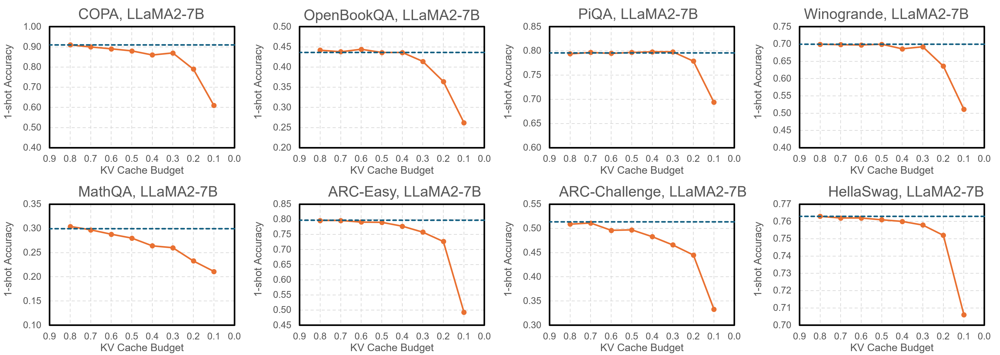

# SpAtten: Sparse Attention with Token Pruning and Head Pruning in Large Language Models


[[paper](https://arxiv.org/abs/2012.09852)] [[slides](https://www.dropbox.com/s/z189gu92h7uy7yt/SpAtten-for-long-video-no-animation.pdf?dl=0)] [[video](https://www.youtube.com/watch?v=Cln8hFxM9Do)] [[website](https://hanlab.mit.edu/projects/spatten)] 

<!--  -->


## TL;DR
We propose sparse attention (SpAtten) with **KV token pruning, local V pruning, head pruning, and KV progressive quantization** to improve LLM efficiency.

## News
- SpAtten and SpAtten-Chip won the 1st Place Award at 2023 DAC University Demo.
- SpAtten is spotlighted on [MIT Homepage](http://mit.edu/spotlight/streamlining-sentence-analysis).
- SpAtten is covered by [MIT News](https://news.mit.edu/2021/language-learning-efficiency-0210).
- [2023/10] SpAtten-LLM and SpAtten hardware released.


## Abstract
We present SpAtten, an efficient algorithm-architecture co-design that leverages token sparsity, head sparsity, and quantization opportunities to reduce the attention computation and memory access. Inspired by the high redundancy of human languages, we propose the novel KV token pruning to prune away unimportant tokens in the sentence. We also propose head pruning to remove unessential heads. Cascade pruning is fundamentally different from weight pruning since there is no trainable weight in the attention mechanism, and the pruned tokens and heads are selected on the fly. To efficiently support them on hardware, we design a novel top-k engine to rank token and head importance scores with high throughput. Furthermore, we propose KV progressive quantization that first fetches MSBs only and performs the computation; if the confidence is low, it fetches LSBs and recomputes the attention outputs, trading computation for memory reduction.

### Token pruning for classification task:
<p align="center">
  
</p>


### Token pruning for generation task:
<p align="center">
  
</p>

## Evaluated Results on LLM

### Perlexity Results
| KV Cache Access (%) | KV Cache Budget (%) | Perplexity on Wikitext2 (lower is better) |
|:-------------------:|:-------------------:|:-----------------------------------------:|
|          20         |          11         |                   5.4627                  |
|          30         |          16         |                   5.3101                  |
|          50         |          29         |                   5.1898                  |
|          70         |          45         |                   5.1409                  |
|          80         |          55         |                   5.1276                  |
|         100         |         100         |                   5.1164                  |

### Accuracy Results

| KV Cache Budget |    COPA   | OpenBookQA |    PiQA   | Winogrande |   MathQA  |  ARC-Easy | ARC-Challenge | HellaSwag |
|:---------------:|:---------:|:----------:|:---------:|:----------:|:---------:|:---------:|:-------------:|:---------:|
|       0.1       |   0.610   |    0.262   |   0.694   |    0.511   |   0.211   |   0.493   |     0.333     |   0.706   |
|       0.2       |   0.790   |    0.364   |   0.779   |    0.636   |   0.233   |   0.727   |     0.445     |   0.752   |
|       0.3       |   0.870   |    0.414   |   0.798   |    0.692   |   0.260   |   0.758   |     0.466     |   0.758   |
|       0.4       |   0.860   |    0.436   |   0.798   |    0.686   |   0.264   |   0.777   |     0.483     |   0.760   |
|       0.5       |   0.880   |    0.436   |   0.797   |    0.699   |   0.280   |   0.790   |     0.497     |   0.761   |
|       0.6       |   0.890   |    0.444   |   0.795   |    0.697   |   0.288   |   0.791   |     0.496     |   0.762   |
|       0.7       |   0.900   |    0.438   |   0.797   |    0.698   |   0.297   |   0.796   |     0.511     |   0.762   |
|       0.8       |   0.910   |    0.442   |   0.794   |    0.699   |   0.304   |   0.796   |     0.509     |   0.763   |
|      **1**      | **0.910** |  **0.440** | **0.800** |  **0.699** | **0.299** | **0.797** |     **0.514** | **0.763** |

<p align="center">
  
</p>


## SpAtten Usage

### Environment Setup

```bash
conda create -yn spatten python=3.10
conda activate spatten

# lmquant for perplexity evaluation
git clone https://github.com/mit-han-lab/lmquant
cd lmquant
poetry install
cd ..

# lmeval for accuracy evaluation
git clone https://github.com/EleutherAI/lm-evaluation-harness
cd lm-evaluation-harness
pip install -e .
cd ..

git clone https://github.com/mit-han-lab/spatten
cd spatten

pip install torch torchvision torchaudio
pip install transformers==4.43.3 accelerate datasets evaluate wandb scikit-learn scipy sentencepiece

python setup.py develop
```

### Evaluate Perlexity 
```bash
python3 eval_spatten.py  --model_name_or_path /path/to/model/llama-2-7b-hf/ --sparsity 0.5 --policy spatten_ratio_size --lmquant_tasks wikitext
```

### Evaluate Accuracy
```bash
python3 eval_spatten.py  --model_name_or_path /path/to/model/llama-2-7b-hf/ --sparsity 0.5 --policy spatten_ratio_size --shots 1 --lmeval_tasks piqa
```
<!-- ### Run SpAtten Llama Chatbot

```bash
CUDA_VISIBLE_DEVICES=0 python run_spatten_llama.py  --enable_spatten
``` -->

## SpAtten Hardware Usage
This repo also contains the RTL-level simulation model of SpAtten in `spatten_hardware/hardware/` for accurate performance evaluation on generative models like GPT-2 and a fast behavior model in `spatten_hardware/simulator` for quick evaluation on BERT.

### Running RTL simulation for SpAtten
#### Prerequisites
- [Verilator](https://www.veripool.org/verilator/) version [v4.218](https://github.com/verilator/verilator/releases/tag/v4.218)

  Note that there is a known [issue](https://github.com/verilator/verilator/issues/4424) with the latest Verilator that may cause random assertion failure on startup of simulation. Use v4.218 as a workaround.
- [SBT](https://www.scala-sbt.org/)
- C/C++ build tools for verilator and ramulator. `gcc,g++>=12`, `cmake`
- Workload information in CSV format. There are some examples in hardware/workloads

#### Quick Start
Build the ramulator2
```
$ cd spatten_hardware/hardware/third_party/ramulator2
$ mkdir build
$ cd build
$ cmake .. -DCMAKE_BUILD_TYPE=RelWithDebInfo
$ make
$ cd ../../../..
```
Build the Verilog (DPI) interface for ramulator
```
$ cd hardware/dpi
$ make
$ cd ../../..
```
Use the python script to run SpAtten simulation with a workload file
```
python3 run_spatten_hardware.py hardware/workloads/summary-gpt2-small-wikitext2-per8.csv
```
The evaluation results is located in the working directory `spatten.workdir/summary.txt`

### SpAtten Hardware Architecture


SpAtten uses a specialized pipeline to support efficient attention and focus on memory traffic optimizations for decoding models like GPT2 and LLMs. 

This repo contains the following major modules in SpAtten, and the main pipeline implementation is in [SpAttenController.scala](./spatten_hardware/hardware/src/main/scala/spatten/SpAttenController.scala).

- A parallelized top-k unit (10) that dynamically decides the values to fetch: [TopK.scala](./spatten_hardware/hardware/src/main/scala/spatten/TopK.scala), which uses [QuickSelect.scala](./spatten_hardware/hardware/src/main/scala/spatten/utils/QuickSelect.scala) to choose the k-th largest element from attention prob
- A matrix fetcher ((3) and (6) in the figure) that loads the key/value matrix from DRAM and convert the bitwidth when necessary: [MatrixFetcher.scala](./spatten_hardware/hardware/src/main/scala/spatten/MatrixFetcher.scala)
- The Q\*K (7) and Prob\*V (11) unit and the corresponding key / value buffers: [DotProduct.scala](./spatten_hardware/hardware/src/main/scala/spatten/DotProduct.scala), [MultiplyValue.scala](./spatten_hardware/hardware/src/main/scala/spatten/MultiplyValue.scala), [Buffer.scala](./spatten_hardware/hardware/src/main/scala/spatten/Buffer.scala), [BufferManager.scala](./spatten_hardware/hardware/src/main/scala/spatten/BufferManager.scala)
- A progressive quantization module (9) to decide whether or not to load the LSBs of keys: [RequantDecision.scala](./spatten_hardware/hardware/src/main/scala/spatten/RequantDecision.scala)


<!-- ## TODOs
We will release the code and data soon, please stay tuned.

- [ ] Release core code of SpAtten, including Llama-2, MPT, Falcon, and Pythia.
- [ ] Release SpAtten perplexity evaluation code
- [ ] Release SpAtten Llama Chatbot demo.
- [ ] Release a docker image for hardware simulation. -->


## Citation

If you find SpAtten useful or relevant to your project and research, please kindly cite our paper:

```bibtex
@article{wang2021spatten,
        title={SpAtten: Efficient Sparse Attention Architecture with Cascade Token and Head Pruning},
        author={Wang, Hanrui and Zhang, Zhekai and Han, Song},
        journal={HPCA},
        year={2021}
        }
```
<!-- 
```bibtex
@article{wang2021spattenllm,
        title={SpAtten-LLM: Sparse Attention with Token Pruning and Head Pruning in Large Language Models},
        author={Wang, Hanrui and Xiao, Guangxuan and Yang, Shang and Tang, Haotian, and Zhang, Zhekai and Han, Song},
        journal={Technical Report},
        year={2023}
        }
``` -->

