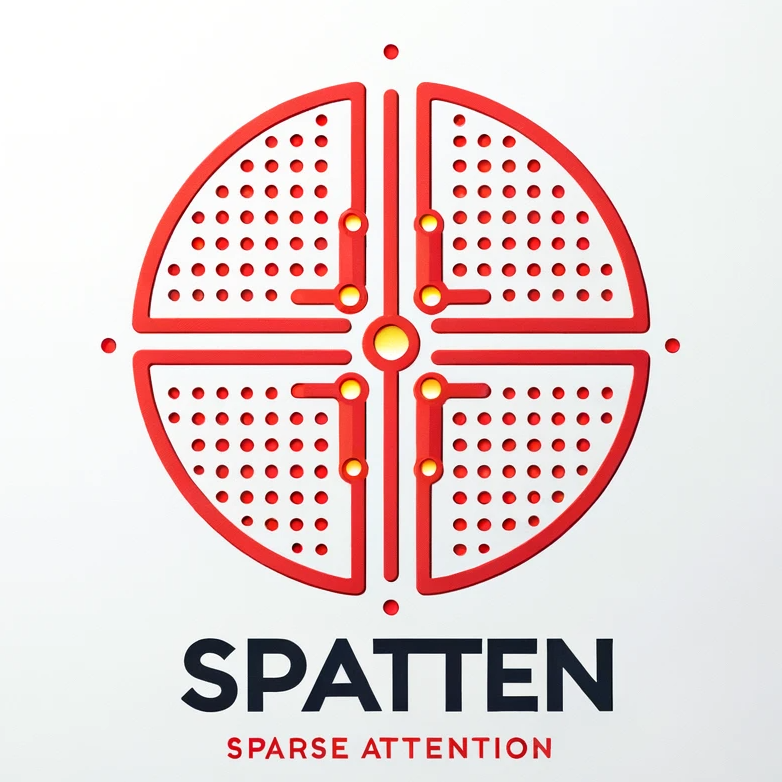

<p align="center">

</p>

# SpAtten: Sparse Attention with Token Pruning and Head Pruning in Large Language Models


[[paper](https://hanlab.mit.edu/projects/spatten)] [[slides](https://www.dropbox.com/s/z189gu92h7uy7yt/SpAtten-for-long-video-no-animation.pdf?dl=0)] [[video](https://www.youtube.com/watch?v=Cln8hFxM9Do)] [[website](spatten.mit.edu)] 

<!--  -->


## TL;DR
We propose sparse attentin (SpAtten) with **token KV pruning, local V pruning and head pruning** to improve LLM efficiency.

## News

- [2023/10] SpAtten-LLM and SpAtten hardware released.


## Abstract
The attention mechanism is becoming increasingly popular in Natural Language Processing (NLP) applications, showing superior performance than convolutional and recurrent architectures. However, general-purpose platforms such as CPUs and GPUs are inefficient when performing attention inference due to complicated data movement and low arithmetic intensity. Moreover, existing NN accelerators mainly focus on optimizing convolutional or recurrent models, and cannot efficiently support attention. In this paper, we present SpAtten, an efficient algorithm-architecture co-design that leverages token sparsity, head sparsity, and quantization opportunities to reduce the attention computation and memory access. Inspired by the high redundancy of human languages, we propose the novel cascade token pruning to prune away unimportant tokens in the sentence. We also propose cascade head pruning to remove unessential heads. Cascade pruning is fundamentally different from weight pruning since there is no trainable weight in the attention mechanism, and the pruned tokens and heads are selected on the fly. To efficiently support them on hardware, we design a novel top-k engine to rank token and head importance scores with high throughput. Furthermore, we propose progressive quantization that first fetches MSBs only and performs the computation; if the confidence is low, it fetches LSBs and recomputes the attention outputs, trading computation for memory reduction.


## SpAtten LLM Usage

### Environment Setup

```bash
conda create -yn spatten python=3.8
conda activate spatten

pip install torch torchvision torchaudio
pip install transformers==4.33.0 accelerate datasets evaluate wandb scikit-learn scipy sentencepiece

python setup.py develop
```

### Run SpAtten Llama Chatbot

```bash
CUDA_VISIBLE_DEVICES=0 python run_spatten_llama.py  --enable_spatten
```

## SpAtten Hardware Usage
This repo also contains the RTL-level simulation model of SpAtten in `spatten_hardware/hardware/` for accurate performance evaluation on generative models like GPT-2 and a fast behavior model in `spatten_hardware/simulator` for quick evaluation on BERT.

### Running RTL simulation for SpAtten
#### Prerequisites
- [Verilator](https://www.veripool.org/verilator/) version [v4.218](https://github.com/verilator/verilator/releases/tag/v4.218)

  Note that there is a known [issue](https://github.com/verilator/verilator/issues/4424) with the latest Verilator that may cause random assertion failure on startup of simulation. Use v4.218 as a workaround.
- [SBT](https://www.scala-sbt.org/)
- C/C++ build tools for verilator and ramulator. `gcc,g++>=12`, `cmake`
- Workload information in CSV format. There are some examples in hardware/workloads

#### Quick Start
Build the ramulator2
```
$ cd hardware/third_party/ramulator2
$ mkdir build
$ cd build
$ cmake .. -DCMAKE_BUILD_TYPE=RelWithDebInfo
$ make
$ cd -
```
Build the Verilog (DPI) interface for ramulator
```
$ cd hardware/dpi
$ make
$ cd -
```
Use the python script to run SpAtten simulation with a workload file
```
python3 run_spatten_hardware.py hardware/workloads/summary-gpt2-small-wikitext2-per8.csv
```


## TODOs
We will release the code and data soon, please stay tuned.

- [ ] Release core code of SpAtten, including Llama-2, MPT, Falcon, and Pythia.
- [ ] Release perplexity evaluation code
- [ ] Release SpAtten Llama Chatbot demo.
- [ ] Release SpAtten evaluation code.


## Citation

If you find SpAtten useful or relevant to your project and research, please kindly cite our paper:

```bibtex
@article{wang2021spatten,
        title={SpAtten: Efficient Sparse Attention Architecture with Cascade Token and Head Pruning},
        author={Wang, Hanrui and Zhang, Zhekai and Han, Song},
        journal={HPCA},
        year={2021}
        }
```
<!-- 
```bibtex
@article{wang2021spattenllm,
        title={SpAtten-LLM: Sparse Attention with Token Pruning and Head Pruning in Large Language Models},
        author={Wang, Hanrui and Xiao, Guangxuan and Yang, Shang and Tang, Haotian, and Zhang, Zhekai and Han, Song},
        journal={Technical Report},
        year={2023}
        }
``` -->
